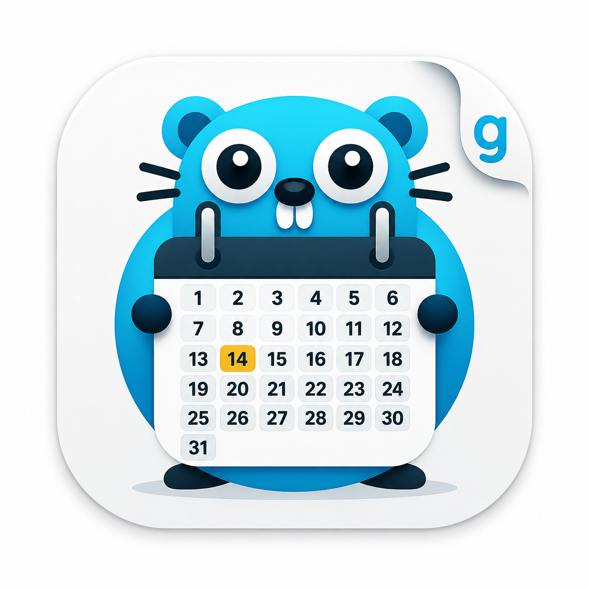

# golang-ical

<p align="center">
  
</p>

An ICS / ICal parser and serialiser for Golang.

[](https://godoc.org/github.com/arran4/golang-ical)

Because the other libraries didn't quite do what I needed.

## Parsing Calendars

Usage, parsing:
```golang
import (
    "strings"

    ics "github.com/arran4/golang-ical"
)
cal, err := ics.ParseCalendar(strings.NewReader(input))
```

Usage, parsing from a URL:
```golang
cal, err := ics.ParseCalendarFromUrl("https://your-ics-url")
```

## Creating Calendars

Usage, creating a calendar:
```golang
cal := ics.NewCalendar()
cal.SetMethod(ics.MethodRequest)
event := cal.AddEvent(fmt.Sprintf("id@domain", p.SessionKey.IntID()))
event.SetCreatedTime(time.Now())
event.SetDtStampTime(time.Now())
event.SetModifiedAt(time.Now())
event.SetStartAt(time.Now())
event.SetEndAt(time.Now())
event.SetSummary("Summary")
event.SetLocation("Address")
event.SetDescription("Description")
event.SetURL("https://URL/")
event.AddRrule(fmt.Sprintf("FREQ=YEARLY;BYMONTH=%d;BYMONTHDAY=%d", time.Now().Month(), time.Now().Day()))
event.SetOrganizer("sender@domain", ics.WithCN("This Machine"))
event.AddAttendee("receiver or participant", ics.CalendarUserTypeIndividual, ics.ParticipationStatusNeedsAction, ics.ParticipationRoleReqParticipant, ics.WithRSVP(true))
return cal.Serialize()
```
*Helper methods created as needed feel free to send a P.R. with more.*

You can also construct a calendar with options:

```golang
cal, err := ics.NewCalendarWithOptions(
    ics.WithVersion("2.0"),
    ics.WithProductId("-//my-service//Golang ICS Library"),
)
```

When to use which constructor:
- Use `NewCalendar()` for the default metadata:
  - `VERSION:2.0`
  - `PRODID:-//arran4//Golang ICS Library`
- Use `NewCalendarFor(service)` when you want the same defaults but a service-specific `PRODID` without building options manually.
  - It sets `VERSION:2.0`.
  - It sets `PRODID:-//<service>//Golang ICS Library`.
  - Example: `ics.NewCalendarFor("my-team")` yields `PRODID:-//my-team//Golang ICS Library`.
- Use `NewCalendarWithOptions(...)` when you need full control at construction time (for example custom `WithVersion(...)` or custom `WithProductId(...)`).

Use `NewCalendarFor(service)` when you publish ICS from multiple applications/tenants and want each feed to identify its producer via `PRODID` while still using library defaults.

### Adding Reminders (VALARM)

To attach a reminder/alarm to an event, create a `VALARM` component and add it to the event:

```golang
event := cal.AddEvent("event-uid@domain")
event.SetSummary("Team meeting")
event.SetStartAt(time.Now())
event.SetEndAt(time.Now().Add(time.Hour))

alarm := ics.NewAlarm("alarm-uid@domain")
alarm.SetAction(ics.ActionDisplay)
alarm.SetTrigger("-PT15M") // fires 15 minutes before DTSTART
alarm.SetDescription("Team meeting starting soon")
event.AddVAlarm(alarm)
```

**Note on `DISPLAY` alarms:** per RFC 5545 §3.6.6, a `DISPLAY` alarm's required properties are `ACTION`, `DESCRIPTION`, and `TRIGGER` — not `SUMMARY`. `SUMMARY` only applies to `EMAIL`-action alarms, where it's used as the message subject. Most calendar clients (Google Calendar, Apple Calendar, Outlook) read `DESCRIPTION` to render the alarm's message text, so make sure to call `SetDescription(...)` — calling only `SetSummary(...)` will produce a valid but silent reminder in many clients.

`TRIGGER` takes an ISO-8601 duration relative to the event's start; a negative duration fires before the start (e.g. `-PT15M` = 15 minutes before, `-PT2H` = 2 hours before).

### Important Note on Line Endings (RFC 5545 Compliance)

By default, `.Serialize()` uses Unix-style line endings (`LF`). To strictly comply with the iCalendar specification (**RFC 5545**), which requires Windows-style line endings (`CRLF`) for broad compatibility with email and calendar clients like Outlook and Apple Calendar, pass the explicit formatting option:

```golang
return cal.Serialize(ics.WithNewLineWindows)
```

## Parsing malformed properties (strict/skip/recover)

By default, parsing is strict and returns an error for malformed content lines.

```golang
cal, err := ics.ParseCalendar(reader)
```

For real-world feeds with malformed properties, use `ParseCalendarWithOptions` and provide a custom property parser.

Pre-built parser helpers are included:
- `SkipPropertyParser`: ignore malformed lines.
- `FallbackParser(LooseParser)`: try strict parsing first, then recover by keeping token/value.

Skip malformed properties:

```golang
cal, err := ics.ParseCalendarWithOptions(reader,
    ics.WithPropertyParser(ics.SkipPropertyParser),
)
```

Recover malformed properties by keeping token + value (dropping malformed params):

```golang
cal, err := ics.ParseCalendarWithOptions(reader,
    ics.WithPropertyParser(ics.FallbackParser(ics.LooseParser)),
)
```

Custom parser behavior:

```golang
import (
    "fmt"
    "strings"

    ics "github.com/arran4/golang-ical"
)

parser := func(rawLine ics.ContentLine) (*ics.BaseProperty, error) {
    // Try strict parsing first.
    line, err := ics.ParseProperty(rawLine)
    if err == nil {
        return line, nil
    }

    // Skip specific lines and continue.
    if strings.Contains(string(rawLine), "X-TKF-") {
        return nil, fmt.Errorf("%w: skipping Tockify extension", ics.ErrPropertySkipped)
    }

    // Abort for everything else.
    return nil, err
}

cal, err := ics.ParseCalendarWithOptions(reader, parser)
```

Notes:
- `ErrPropertySkipped` means "ignore this line and continue".
- Returning `(nil, nil)` from a parser also skips the line.
- `WithPropertyParser(...)` and passing a parser directly to `ParseCalendarWithOptions(...)` are equivalent.
- The same parser is used for nested components (for example, malformed properties inside `VALARM`).
- Invalid option types return an error wrapped with `ErrInvalidOpArg`.

## Working with Recurring Events

This library parses and provides typed access to recurrence properties (`RRULE`, `RDATE`, `EXDATE`, `EXRULE`, `RECURRENCE-ID`) but does not expand them into concrete occurrence dates.
This keeps the library dependency-free and lets callers choose their own expansion strategy.

### Accessing recurrence properties

```golang
  // Parse RRULE into a structured type
  rules, err := event.GetRRules()
  for _, rule := range rules {
      fmt.Println(rule.Freq)       // e.g. ics.FrequencyYearly
      fmt.Println(rule.ByMonth)    // e.g. [10]
      fmt.Println(rule.ByDay)      // e.g. [{OrdWeek:-1 Day:SU}]
      fmt.Println(rule.Count)      // e.g. 10
      fmt.Println(rule.Interval)   // e.g. 1
  }

  // Get excluded dates (handles comma-separated values and multiple properties)
  exDates, err := event.GetExDates()    // []time.Time
  rDates, err := event.GetRDates()      // []time.Time

  // Get recurrence ID (for modified/cancelled occurrences)
  recID, err := event.GetRecurrenceID() // time.Time

  // Serialize a RecurrenceRule back to RRULE format
  rule, _ := ics.ParseRecurrenceRule("FREQ=WEEKLY;INTERVAL=2;BYDAY=MO,WE,FR")
  fmt.Println(rule.String()) // "FREQ=WEEKLY;INTERVAL=2;BYDAY=MO,WE,FR"
```

### Expanding occurrences with rrule-go

To expand recurring events into concrete dates, use a library like [rrule-go](https://github.com/teambition/rrule-go):

```golang
  import (
      ics "github.com/arran4/golang-ical"
      "github.com/teambition/rrule-go"
  )

  // Parse your calendar
  cal, _ := ics.ParseCalendar(reader)

  for _, event := range cal.Events() {
      dtstart, _ := event.GetStartAt()
      dtend, _ := event.GetEndAt()
      duration := dtend.Sub(dtstart)

      // Build an RRuleSet from the event's recurrence properties
      set := &rrule.Set{}

      rules, _ := event.GetRRules()
      for _, r := range rules {
          rr, _ := rrule.StrToRRule(r.String())
          rr.DTStart(dtstart)
          set.RRule(rr)
      }

      rDates, _ := event.GetRDates()
      for _, rd := range rDates {
          set.RDate(rd)
      }

      exDates, _ := event.GetExDates()
      for _, exd := range exDates {
          set.ExDate(exd)
      }

      // Get all occurrences in a time range
      occurrences := set.Between(rangeStart, rangeEnd, true)

      // Each occurrence is a start time; compute the end from the original duration
      for _, occ := range occurrences {
          fmt.Printf("  %s to %s\n", occ, occ.Add(duration))
      }
  }
```

### Handling RECURRENCE-ID overrides

Calendar feeds use `RECURRENCE-ID` to modify or cancel individual occurrences of a recurring event.
These appear as separate VEVENTs with the same UID but a `RECURRENCE-ID` property indicating which occurrence they replace.

```golang
  type overrideKey struct {
      UID   string
      Start time.Time
  }

  overrides := map[overrideKey]*ics.VEvent{}
  var regularEvents []*ics.VEvent

  for _, event := range cal.Events() {
      recID, err := event.GetRecurrenceID()
      if err == nil {
          uid := event.GetProperty(ics.ComponentPropertyUniqueId).Value
          overrides[overrideKey{UID: uid, Start: recID}] = event
      } else {
          regularEvents = append(regularEvents, event)
      }
  }

  // After expanding occurrences from regularEvents, check each generated
  // occurrence against the overrides map. If a match is found, replace that
  // occurrence with the override's times/properties (or remove it if the
  // override represents a cancellation).
```

## Notice

Looking for a co-maintainer.
